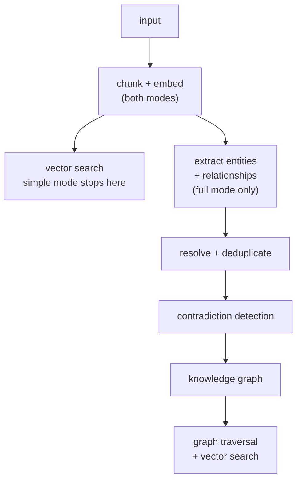
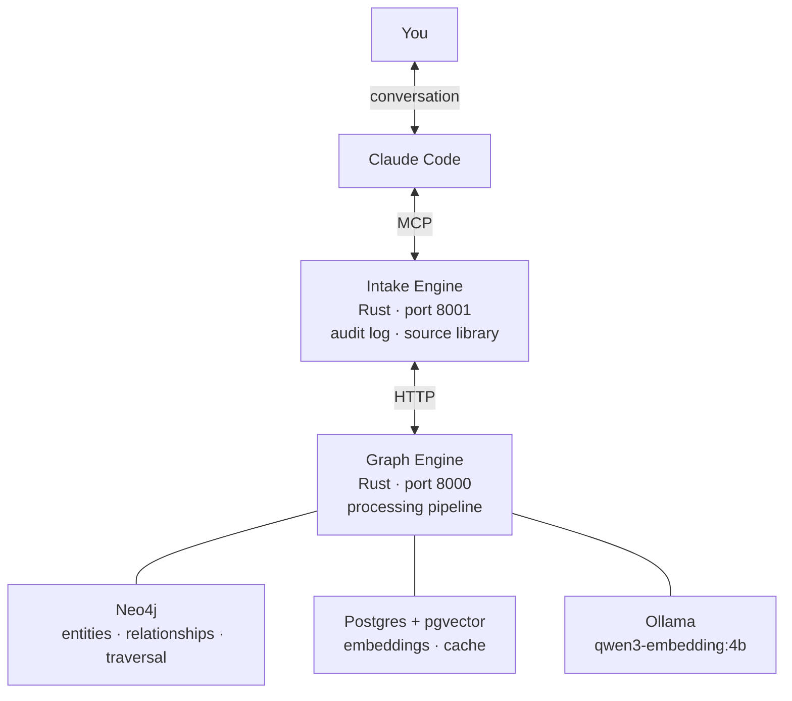

<p align="center">
  <picture>
    
  </picture>
</p>

---

Directed knowledge processing with hybrid retrieval.

Feed it anything: research papers, field notes, financial data, technical specs, personal reflections. Choose a processing lens. Retrieve it later through vector similarity, full-text search, or graph traversal across everything it's seen.

Works for a single researcher accumulating knowledge over years, or a team building shared context across a project. The architecture is the same. Channels define what gets extracted, the graph connects it over time.

## When This Is Useful

You read 200 papers, ingest 50 filings, accumulate notes across three fields over two years. You can't remember which document connected copper supply chains to AI data center demand, where you saw the projected deficit numbers, or which analyst report contradicted the thesis. A due diligence process, a literature review, a personal investment thesis, a multi-year research program. Any context where knowledge accumulates faster than memory can hold it.

Vector search finds the right passages. Graph traversal finds the connections between them (AI compute → power demand → copper consumption → mining companies → ETFs) across documents ingested months apart through different channels. The system gets more valuable as it grows. At hundreds of documents across domains, the connections between a policy change, a supply constraint, and an investment vehicle exist in the graph but not in anyone's memory.

Vector retrieval outperforms manual search from day one. Graph traversal adds 20-65% on multi-hop queries (arXiv:2502.11371), 38% on temporal reasoning (arXiv:2501.13956), and 7-9% on corpus-wide summarization (arXiv:2404.16130). The two layers are complementary. Use one or both depending on the question. Graph gains are strongest on relational and temporal queries, more modest on simple factual lookups (arXiv:2506.06331).

## Workflow

### 1. Research

> /explore copper supply chain dynamics for AI infrastructure

Multi-phase directed research: protocol pre-registration → external search → follow threads → check existing knowledge → steelman counter-positions → synthesize → identify gaps.

Findings are presented for review. Nothing is ingested automatically.

### 2. Ingest

**Simple** (store and embed). Vector search works immediately. No extraction cost.

> Store this quickly, I just need to find it later.

```
just ingest-simple paper.pdf
```

**Full** (extract entities and relationships into the knowledge graph). Relational queries across documents.

> Ingest this through the investment channel.

```
just ingest paper.pdf investment
```

Upgrade any time. Documents ingested simply can be integrated into the graph later:

```
just integrate research
```



### 3. Query

Through conversation:

> Which investments have exposure to AI infrastructure bottlenecks?

> What do I know about copper supply deficits?

> What connections exist between the documents I ingested last month?

Through CLI:

```
just search "AI infrastructure bottlenecks"
just search-keyword "copper"
```

Simple mode returns vector similarity on chunks.
Full mode runs vector similarity, full-text search, and graph traversal in parallel, returning relationship chains that connect entities across documents.

### 4. Replay and Correct

Your understanding of a topic evolves. The channels you define improve. The questions you ask change. The system is designed for this. Every ingestion is logged with full provenance (source hash, channel prompt version, timestamp), and any document can be reprocessed through a different lens without re-uploading.

You ingested a research paper months ago through `research`. Now you realize it has investment implications:

> Replay that document through the investment channel.

You refined your investment channel prompt to extract pricing context better. Re-integrate the dataset. Only unprocessed or changed chunks are re-extracted:

> Re-integrate the investment dataset.

```
just replay <entry-id> --prompt investment
just integrate investment
```

Nothing is lost. When new extraction contradicts an existing relationship, the old one is superseded with a `valid_until` timestamp, not deleted. The full history of what was known and when is preserved. Identical facts from new documents strengthen existing relationships by incrementing their weight, so frequently confirmed knowledge surfaces higher in search results.

## Channels

`channels/` contains `.md` files. Each file is a processing lens. The filename is the channel name.

```
channels/
  research.md       claims, concepts, relationships, source quality
  investment.md     tickers, material deps, supply/demand, pricing context
  personal.md       next steps, connections to active work, discard noise
  sources.md        API endpoints, data formats, access requirements, gaps
```

Same input through different channels produces different extraction. A research paper through `research` extracts claims and evidence quality. The same paper through `investment` extracts material dependencies and company exposure. Through `personal` it extracts only what connects to your active work.

Create a new channel by adding a `.md` file. For a project: `competitor-analysis.md`, `regulatory-filings.md`, `customer-interviews.md`. For personal use: `worldview.md`, `reading-notes.md`, `technical.md`.

## Architecture



The **intake engine** logs every ingestion, stores source documents in a content-addressed library (SHA-256), tracks prompt versions, and supports replay with different lenses.

The **graph engine** handles the processing pipeline: chunking, embedding, LLM extraction with gleaning (+15-30% recall), entity resolution, temporal contradiction detection, and community detection. Storage backends are pluggable (Neo4j for graph, Postgres for vectors).

## Lineage

Analyzed five open-source knowledge graph systems. Each adopted technique traces to a codebase and research paper.

[GraphRAG](https://github.com/microsoft/graphrag) — gleaning (+15-30% entity recall), community detection. arXiv:2404.16130

[Graphiti](https://github.com/getzep/graphiti) — bi-temporal contradiction detection, entity resolution cascade, negative-example prompting. arXiv:2501.13956

[KGGen](https://github.com/stair-lab/kg-gen) — SEMHASH normalization, edge deduplication. NeurIPS 2025

[nano-graphrag](https://github.com/gusye1234/nano-graphrag) — LLM response cache (30-50% API cost reduction)

[LightRAG](https://github.com/HKUDS/LightRAG) — dual-level retrieval (studied, not yet adopted). EMNLP 2025

Full analysis: [`graph-engine/analysis/`](graph-engine/analysis/) · [`FEATURES.md`](graph-engine/FEATURES.md)

## Setup

Requires [Docker](https://docs.docker.com/get-docker/) and an [Anthropic API key](https://console.anthropic.com/) (for full mode extraction).

```bash
git clone <repo>
cd second-mind
cp docker/.env.example docker/.env
cp -r channels.example channels
```

Add your Anthropic API key to `.env`, then:

```bash
just setup
```

Simple mode (vector search only) works without an API key.

## Commands

```
just ingest-simple <file> [channel]   store + embed (vector search only)
just ingest <file> [channel]          store + embed + extract (full graph)
just search <query> [dataset]         search (all modes)
just search-keyword <query>           fast full-text search
just integrate <dataset>              extract entities from stored documents
just replay [id] [--prompt p]         reprocess with different lens
just compact                          deduplicate intake log
just up / down / status               services
just logs                             container logs
just fmt / check / clippy / test      development
```

## Structure

```
graph-engine/        processing + storage engine (Rust, Axum)
intake-engine/       MCP server + audit log (Rust)
channels/            processing lenses (one .md per channel)
channels.example/    generic examples
docker/              Docker Compose, .env.example
data/                intake log, source library
```

[`architecture.md`](architecture.md) · [`FEATURES.md`](graph-engine/FEATURES.md) · [`PLAN.md`](graph-engine/PLAN.md)
